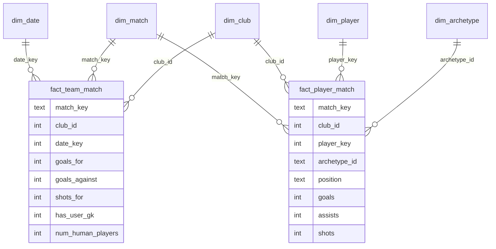

# EAFC26 Pro Clubs Analytics — Single Source of Truth

> The canonical reference for what this project is, where the data comes from, and how it is modeled.
> If code and this document disagree, treat this document as the intended design and fix the code (or update this doc deliberately).

---

## 1. Purpose & audiences

A low/no-cost analytics product for our EAFC26 Pro Clubs team (club id **`127516`**). It serves two audiences from one data model:

| Audience | Wants | Example |
| --- | --- | --- |
| Players (fun) | Personal and leaderboard stats | "Who has the most goals + assists this season?" |
| Captain (decisions) | Roster / tactical insight | "How many shots and goals do we concede with a user GK vs a CPU GK?" |

The model is deliberately **two-sided** (it stores both clubs in every match) so questions about the opponent — shots conceded, opponent keeper, scouting — are joins rather than one-off scripts.

---

## 2. Architecture

```
EA Pro Clubs API  ──►  GitHub Actions (Python ETL, cron)  ──►  SQLite warehouse file  ──►  Static site
   (league +              extract → land raw JSON →               (committed to repo;          (reads the
    playoff endpoints)     transform → load star schema            later: Turso)                DB / views)
                           → build views → commit
```

Cost target: **$0** to start. Public GitHub repo → unlimited free Actions minutes; SQLite file committed to the repo → no database service to pay for or keep alive. Graduate to a hosted DB (Turso) only when adding live self-service querying / NL2SQL.

### Phases
1. Perfect the Python scripts locally (this repo's notebooks → a runnable `loader.py`).
2. Push scripts to the repo.
3. Schedule the cron (hourly during play windows — see §7).
4. Commit the populated warehouse file.
5. Stand up the static site over the views.
6. *(Future)* NL2SQL chat against the warehouse.

---

## 3. Data source — EA Pro Clubs API

- **Endpoint:** `GET https://proclubs.ea.com/api/fc/clubs/matches`
- **Params:** `clubIds=127516`, `platform=common-gen5`, `matchType=leagueMatch` **or** `matchType=playoffMatch`
- **Auth:** none, but the endpoint rejects non-browser clients. You must send browser-like headers (User-Agent, Accept, Referer/Origin `https://www.ea.com`) **and warm up the session** with a `GET https://www.ea.com/` first, reusing the same `requests.Session`.
- **Response:** a JSON **list** of recent matches (typically the **last ~5**), newest first.
- **League vs playoff:** determined by the `matchType` parameter you send. Tag `competition` from that parameter at fetch time — it is authoritative. (An optional playoff-date lookup table can be kept purely as a cross-check.)

### Quirks that drive the model
1. **Only human players appear** in `players[clubId]`. Empty slots are AI and produce no row. Rosters range ~5–11 per club.
2. **A CPU goalkeeper produces no GK row.** Therefore "did this club use a user keeper?" = *does this club have any player with `pos == 'goalkeeper'`?*
3. **There is no club-level `shots` field.** Team shot totals live only in the `aggregate` block: `aggregate[clubId]['shots']`. This is the only way to get the **opponent's** shots (i.e. shots we conceded), since we could otherwise only sum our own players.
4. The API re-serves the same recent matches on every poll, so the loader must be **idempotent** (see §6).

### JSON anatomy
```
match
├─ matchId            # natural match key
├─ timestamp          # unix seconds (UTC)
├─ clubs[clubId]      # club-level: goals, goalsAgainst, wins, losses, ties,
│                     #   result, matchType, winnerByDnf, season_id, details{name,...}
├─ players[clubId][playerId]   # per-human-player stats (pos, goals, assists,
│                              #   shots, saves, goalsconceded, rating, mom, ...)
└─ aggregate[clubId]  # club totals incl. `shots`  ← team shot source
```

---

## 4. Data model (star schema)

Two fact tables sharing conformed dimensions. Surrogate key on player (for slowly-changing names); natural keys elsewhere.



### Grain (read this twice)
| Table | One row per | Notes |
| --- | --- | --- |
| `dim_date` | calendar day (local) | pure calendar; no per-match attributes |
| `dim_match` | match | carries hour, season, competition |
| `dim_club` | club | both our club and opponents |
| `dim_player` | player **version** | SCD2; opponents included |
| `dim_archetype` | archetype id | lookup |
| `fact_team_match` | **match × club** | two rows per match |
| `fact_player_match` | **match × club × player** | both clubs' humans |

### `dim_date`
| Column | Type | Source / rule |
| --- | --- | --- |
| `date_key` (PK) | INTEGER | `YYYYMMDD` in **local** zone |
| `full_date` | TEXT | ISO date (local) |
| `day_of_week` | TEXT | local |
| `is_weekend` | INTEGER | local weekday ≥ 5 |
| `month` | INTEGER | local |
| `year` | INTEGER | local |

### `dim_match`
| Column | Type | Source / rule |
| --- | --- | --- |
| `match_key` (PK) | TEXT | `matchId` |
| `match_timestamp` | INTEGER | `timestamp` (unix, UTC) |
| `date_key` (FK) | INTEGER | → `dim_date` |
| `match_hour_local` | INTEGER | hour 0–23 in local zone *(moved here from dim_date)* |
| `season_id` | INTEGER | `clubs[*].season_id` |
| `match_type_code` | TEXT | `clubs[*].matchType` (raw, e.g. `3`) |
| `competition` | TEXT | `league` / `playoff` — from the endpoint param used |

### `dim_club`
| Column | Type | Source / rule |
| --- | --- | --- |
| `club_id` (PK) | INTEGER | clubs key |
| `club_name` | TEXT | `clubs[id].details.name` (latest seen) |
| `is_our_club` | INTEGER | `1` where `club_id = 127516` |

### `dim_player` (SCD Type 2)
| Column | Type | Source / rule |
| --- | --- | --- |
| `player_key` (PK) | INTEGER | surrogate, autoincrement |
| `player_id` | TEXT | natural id from JSON |
| `player_name` | TEXT | `players[*][id].playername` |
| `effective_start_date` | TEXT | first seen (match date) |
| `effective_end_date` | TEXT | NULL while current |
| `is_current` | INTEGER | `1` for the live version |

### `dim_archetype`
| Column | Type | Source / rule |
| --- | --- | --- |
| `archetype_id` (PK) | TEXT | `players[*][id].archetypeid` |
| `archetype_name` | TEXT | maintained lookup (fallback = id) |
| `archetype_category` | TEXT | `attacking` / `midfield` / `defensive` / `goalkeeper` |

### `fact_team_match`  — grain: match × club
| Column | Type | Source / rule |
| --- | --- | --- |
| `match_key` (PK) | TEXT | with `club_id` |
| `club_id` (PK, FK) | INTEGER | → `dim_club` |
| `date_key` (FK) | INTEGER | → `dim_date` |
| `goals_for` | INTEGER | `clubs[club].goals` |
| `goals_against` | INTEGER | `clubs[club].goalsAgainst` |
| `shots_for` | INTEGER | **`aggregate[club].shots`** |
| `result_code` | TEXT | `clubs[club].result` |
| `is_win` / `is_loss` / `is_tie` | INTEGER | `clubs[club].wins/losses/ties` |
| `winner_by_dnf` | INTEGER | `clubs[club].winnerByDnf` |
| `has_user_gk` | INTEGER | `1` if any player in `players[club]` has `pos == 'goalkeeper'` |
| `num_human_players` | INTEGER | `len(players[club])` |

> **Shots/goals conceded are not stored** — they are the opponent row's `shots_for` / `goals_for`, reached by a self-join on `match_key` where `club_id <> ours`. (`goals_against` is also stored directly as a convenience.)

### `fact_player_match`  — grain: match × club × player
Keys: `match_key`, `club_id`, `player_key` (composite PK); FKs to `dim_match`, `dim_club`, `dim_player`, `dim_archetype`.
Measures (all per player per match): `position`, `goals`, `assists`, `rating`, `shots`, `pass_attempts`, `passes_made`, `tackle_attempts`, `tackles_made`, `man_of_match`, `seconds_played`, `red_cards`, `clean_sheet_any`, `goals_conceded`, `saves`, `ball_dive_saves`, `cross_saves`, `parry_saves`, `punch_saves`, `reflex_saves`, `good_direction_saves`.

---

## 5. Derived fields & rules (the things that aren't 1:1 from JSON)

| Field | Rule |
| --- | --- |
| `has_user_gk` | existence of a `pos == 'goalkeeper'` player row for that club |
| `num_human_players` | count of player rows for that club |
| `shots_for` | from `aggregate[club].shots`, **never** from summing player shots |
| `competition` | from the `matchType` request parameter, not the JSON code |
| date parts | derived in **America/New_York**, not UTC (we play evenings; UTC rolls late games into the next day) |
| `match_hour_local` | local hour, stored on `dim_match` |

---

## 6. Identity & idempotency

- **Match identity:** `matchId`. The loader skips/UPSERTs matches already present, so re-polling the same recent matches is a no-op.
- **Unique keys enforce safety:** `fact_team_match (match_key, club_id)` and `fact_player_match (match_key, club_id, player_key)`. Loads use `INSERT … ON CONFLICT … DO UPDATE`.
- **Raw landing zone:** every fetched match is written to `raw/{matchId}.json` (filename = natural dedupe). The raw layer is the replayable source of truth; the warehouse can always be rebuilt from it.
- **Incremental:** only matches not already in `dim_match` need full processing; everything else is an idempotent upsert.

---

## 7. Scheduling

We play on varying days, evenings into midnight, and the API holds the last ~5 games. So poll **hourly across the evening window** rather than once daily.

- GitHub Actions cron is **UTC** and does **not** observe DST. West Palm Beach is `America/New_York` (UTC-4 in summer / UTC-5 in winter).
- 6pm–midnight ET ≈ **22:00–04:00 UTC (summer)** / **23:00–05:00 UTC (winter)**. Run `0 0-5,22-23 * * *` to cover both year-round, then trim if desired.
- Scheduled Actions can be delayed several minutes under load — fine for an hourly poll.

---

## 8. Business question → model map

| Question | How it's answered |
| --- | --- |
| Most goals + assists this season | `fact_player_match` → `dim_player` (current), filter our club + `dim_match.season_id`, sum `goals + assists`, rank |
| Shots & goals conceded with user vs CPU GK | self-join `fact_team_match` (ours ↔ opponent on `match_key`), `GROUP BY has_user_gk`, avg of opponent `shots_for` / `goals_for` |
| Performance at n-vs-n player counts | self-join `fact_team_match`, compare our `num_human_players` vs opponent's, aggregate win rate / goal diff |
| Team comps with best win/goal rate | roster set from `fact_player_match` (our club, per match) → join `fact_team_match` result/goals → group by the player set |
| Which archetype to spec into | per-player trends in `fact_player_match` (passing vs shooting vs defending) vs current `archetype_id` → `dim_archetype` for labels |

**Canonical captain query** (the one that previously needed raw-JSON parsing):
```sql
SELECT us.has_user_gk,
       COUNT(*)                  AS games,
       ROUND(AVG(opp.shots_for),1) AS avg_shots_conceded,
       ROUND(AVG(opp.goals_for),1) AS avg_goals_conceded
FROM fact_team_match us
JOIN fact_team_match opp
  ON opp.match_key = us.match_key AND opp.club_id <> us.club_id
WHERE us.club_id = 127516
GROUP BY us.has_user_gk;
```

---

## 9. Glossary — EA field → column

| EA JSON field | Column | Table |
| --- | --- | --- |
| `matchId` | `match_key` | dim_match / facts |
| `timestamp` | `match_timestamp` | dim_match |
| `clubs[c].goals` | `goals_for` | fact_team_match |
| `clubs[c].goalsAgainst` | `goals_against` | fact_team_match |
| `aggregate[c].shots` | `shots_for` | fact_team_match |
| `clubs[c].result` | `result_code` | fact_team_match |
| `clubs[c].matchType` | `match_type_code` | dim_match |
| `players[c][p].pos` | `position` | fact_player_match |
| `players[c][p].archetypeid` | `archetype_id` | fact_player_match |
| `players[c][p].playername` | `player_name` | dim_player |
| `players[c][p].passesmade` / `passattempts` | `passes_made` / `pass_attempts` | fact_player_match |
| `players[c][p].tacklesmade` / `tackleattempts` | `tackles_made` / `tackle_attempts` | fact_player_match |
| `players[c][p].mom` | `man_of_match` | fact_player_match |
| `players[c][p].goalsconceded` | `goals_conceded` | fact_player_match |
| `players[c][p].ballDiveSaves` … `goodDirectionSaves` | `ball_dive_saves` … `good_direction_saves` | fact_player_match |

---

## 10. Conventions

- snake_case columns; `dim_` / `fact_` prefixes.
- Keys: surrogate only where SCD is needed (player); natural elsewhere.
- All times stored as unix (`match_timestamp`) **and** decomposed in local zone for calendar attributes.
- The raw JSON layer is never edited; the warehouse is always rebuildable from it.

## 11. Open assumptions
- `aggregate[club].shots` is the authoritative team shot total (held true across sample matches; revisit if AI players are ever shown to contribute shots not reflected there).
- `platform=common-gen5` is correct for our squad; change if the club migrates platforms.
- `dim_archetype` labels are maintained by hand from EA's archetype list; unknown ids fall back to the raw id.
